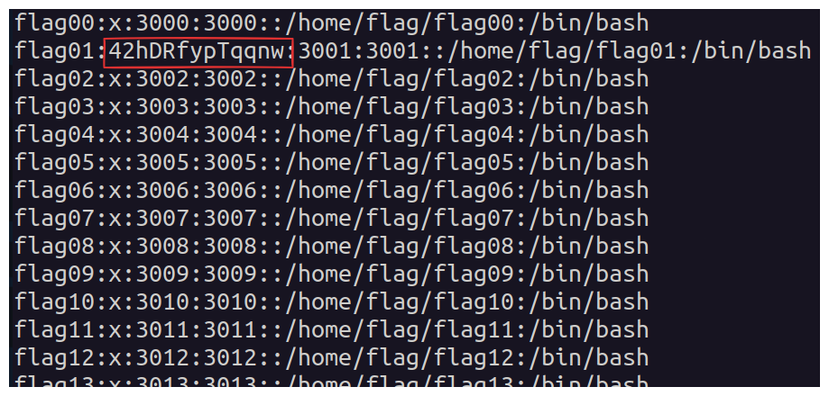

## Level Challenge

For this level, check out the `/etc/passwd` file where the user information is stored.  
Each line of this file contains the following information:  

username:x:UID:GID:description:home_directory:shell

The `x` field stores the password encrypted using a weak hash algorithm, specifically a DES-based `crypt(3)` hash.  
I used the tool **John the Ripper** to decrypt this password. After successfully decrypting it, I obtained the password needed to get the flag.
