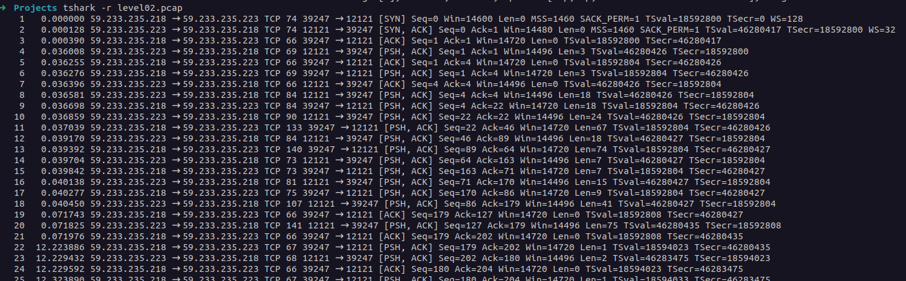
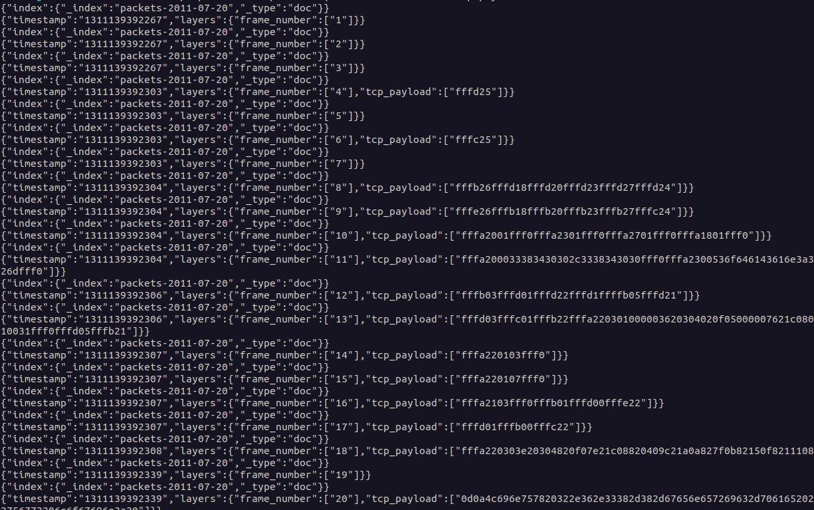
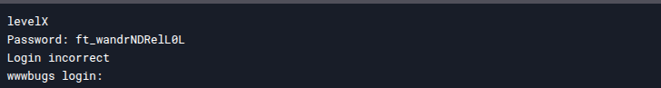

# Network Traffic Analysis with Tcpdump and TShark

## Overview

I discovered a `.pcap` file, which I knew was generated using `tcpdump`, a data packet analyzer program. To analyze its contents, I researched and found that `TShark`, a powerful tool for reading and transforming `.pcap` files, could be used for this purpose.

## Steps Taken

1. **Reading the **``** File** I ran the following command to inspect the captured network traffic:

   ```sh
   tshark -r level02.pcap
   ```

   This displayed the different network packets that were captured at the time.

   

2. **Extracting Payload Data** To filter out only the payload transmitted in the network packets, I used `TShark` with specific flags:

   ```sh
   tshark -r level02.pcap -Tek -E separator='|' -e frame.number -e tcp.payload
   ```

   This command extracted and displayed the payload in hexadecimal format.

   


3. **Decoding the Payload** I then used an AI tool to convert the extracted hexadecimal payload into plain text. This conversion revealed a password hidden in the network traffic.



4. **Using the Password** After obtaining the password, I entered it and successfully retrieved the flag.

## Conclusion

By leveraging `tcpdump` and `TShark`, I was able to analyze and extract meaningful data from a `.pcap` file. This process demonstrated how packet capture analysis can be used to uncover hidden information in network traffic.
