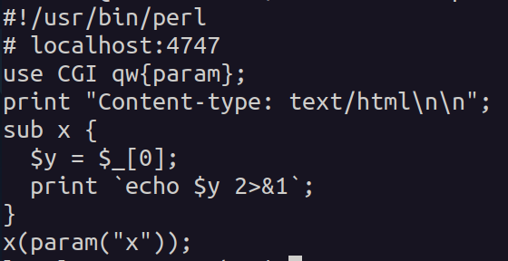
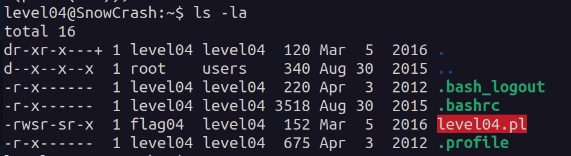

## Overview
In the home directory of the `level04` user, there is a Perl script that imports the `CGI` module and processes an HTTP request parameter named `x`. The script retrieves the parameter value and prints it using the `echo` command.

## Analysis
- The script is owned by `flag05`, meaning any execution of the script runs with `flag05` privileges.
  
   

- Since the script directly echoes the input parameter, it may be **vulnerable to command injection**.
- By passing a specially crafted parameter via the URL, we can execute arbitrary commands under the `flag05` user.

## Exploitation
By injecting the `getflag` command into the request parameter, the script executes it with `flag05` privileges, revealing the flag.
